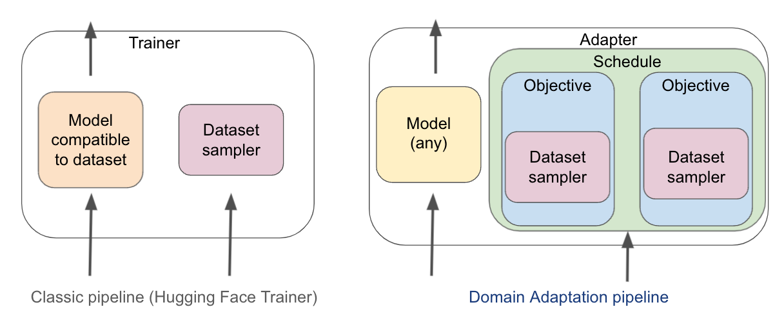

## Domain Adaptation framework

DA library will help you to easily adapt a language model to your own data domain or task.

### Why should I care about adaptation?

Both [domain adaptation](https://aclanthology.org/D19-1371/) 
and [task adaptation](https://aclanthology.org/2020.acl-main.740/)
are reported to **consistently** improve quality of the language models on end tasks, 
and improve model's comprehension on more [niche domains](https://aclanthology.org/W17-3204/),
making it essentially *always* a good idea to do. However, it is tedious to mangle with multi-step
or multi-objective training, because models' architectures and hence also inputs and outputs depend 
on the specific objectives chosen by their authors.

### How DA handles training?

Domain Adaptation (`DA`) framework abstracts the term of *Objective* away from the model.
*Any* objective can be applied to *any* model, for as long as it can get a *head* of compatible shape.

The ordering in which the `Objective`s are applied is determined by given `Schedule` instance.
Conventionally, the objectives are applied *sequentially* (that's what `SequentialSchedule` does), 
but they might as well be applied in a rotation (`StridedSchedule`), or balanced dynamically, 
e.g. according to its objectives` losses (coming soon).



In `DA` framework, instead of providing the `Trainer` with a model and a dataset, 
user constructs a `Schedule` composed of the initialised `Objective`s, where each Objective performs its
dataset sampling and objective-specific feature alignment (compliant with `objective.compatible_head`).

### Why is it useful?

DA introduces objective-centric, instead of model-centric approach to the training process, 
that makes it **easier** to experiment with trainings on **multiple objectives**. Thanks to that, you can do some things,
that are difficult, or not possible at all in other NLP frameworks (like HF Transformers, FairSeq or SciPy). For example:
* **Domain adaptation** or **Task adaptation**: thanks to DA, you do not have to handle the model 
between different training scripts, minimising a chance of error and improving reproducibility 
* Seamlessly experiment with different **schedule** strategies, allowing you e.g. to backpropagate based 
on multiple objectives in every training step
* **Track the progress** of the model, concurrently on *each* relevant objective, allowing you to easier 
recognise weak points of your model
* Easily perform **Multi-task learning**, which [reportedly](https://direct.mit.edu/tacl/article/doi/10.1162/tacl_a_00335/96483/An-Empirical-Study-on-Robustness-to-Spurious) 
improves model robustness
* Although DA aims primarily for adapting the models of transformer family, the library is designed to
work with **any PyTorch model** 

Built upon the well-established and maintained 🤗 Transformers library, DA library will support 
future new NLP models out-of-box. The adaptation of DA to your selected version of Transformers library 
should not take longer than a few minutes.

### How to use this:

First, install the library. If you clone it, you can also use the provided example scripts.
```shell
git clone {this repo}
cd DA
python -m pip install -e .
```

You can find and run the full examples from below in `tests/end2end_usecases_test.py` folder.

#### Adapted Named Entity Recognition

Say you have nicely annotated entities in a set of news articles, but eventually you want to use the language model
to detect entities in invoices, for example. You can either train the NER model on news articles, hoping that
it will not lose much of accuracy on other domain. Or you can concurrently train on both data sets:

```python
# 1. pick the models - randomly pre-initialize the appropriate heads
lang_module = LangModule(test_base_models["token_classification"],
                         head_types=[Head.LANGUAGE_MODEL, Head.TOKEN_CLASSIFICATION],
                         head_kwargs=[{}, {"num_labels": 3}])

# 2. pick objectives
# Objectives take either List[str] for in-memory iteration, or a source file path for streamed iteration
objectives = [MaskedLanguageModeling(lang_module,
                                     batch_size=16,
                                     texts_or_path="mock_data/domain_unsup.txt"),
              TokenClassification(lang_module,
                                  batch_size=16,
                                  texts_or_path="tests/mock_data/ner_texts_sup.txt",
                                  labels_or_path="mock_data/ner_texts_sup_labels.txt")]
# 3. pick a schedule of the selected objectives
# This one will initially fit the first objective to the convergence on its eval set, fit the second 
schedule = SequentialSchedule(objectives, training_arguments)

# 4. Run the training using Adapter, similarly to running HF.Trainer, only adding `schedule`
adapter = Adapter(lang_module, schedule, training_arguments)
adapter.train()

# 5. save the trained lang_module (with all heads)
adapter.save_model("entity_detector_model")

# 6. reload and use it like any other Hugging Face model
ner_model = AutoModelForTokenClassification.from_pretrained("entity_detector_model")
tokenizer = AutoTokenizer.from_pretrained("entity_detector_model")

inputs = tokenizer("Is there any Abraham Lincoln here?")
outputs = ner_model(**inputs)
print(tokenizer.batch_decode(outputs))
```

#### Adapted Machine Translation

Say you have a lot of clean parallel texts for news articles (just like you can find on [OPUS](https://opus.nlpl.eu/)),
but eventually, you need to translate a different domain, for example chats with a lot of typos, 
or medicine texts with a lot of latin expressions.

```python
# 1. pick the models - randomly pre-initialize the appropriate heads
lang_module = LangModule(test_base_models["translation"], head_types=[Head.LANGUAGE_MODEL])

# 2. pick objectives - we use BART's objective for adaptation and mBART's seq2seq objective for fine-tuning
objectives = [DenoisingObjective(lang_module,
                                 batch_size=1,
                                 texts_or_path="tests/mock_data/domain_unsup.txt"),
              DecoderSequence2Sequence(lang_module,
                                       batch_size=1,
                                       texts_or_path="tests/mock_data/seq2seq_sources.txt",
                                       labels_or_path="tests/mock_data/seq2seq_targets.txt",
                                       source_lang_id="en", target_lang_id="cs")]
# 3. pick a schedule of the selected objectives
# this one will shuffle the batches of both objectives
schedule = StridedSchedule(objectives, training_arguments)

# 4. train using Adapter
adapter = Adapter(lang_module, schedule, training_arguments)
adapter.train()

# 5. save the trained (multi-headed) lang_module
adapter.save_model("translator_model")

# 6. reload and use it like any other Hugging Face model
translator_model = AutoModelForSeq2SeqLM.from_pretrained("translator_model")
```
**Try this example** with automated training texts resolution from OPUS in `examples/machine_translation/train_wiki_adapt_bible.py`

#### More examples - coming soon

but contributions are welcome :) (see  below*How can you contribute*)

### Why are we doing this?

We've seen that transformers can outstandingly model very complicated tasks, which makes us 
think that experimenting with more complex training objectives can also improve their desperately-needed
lack of generalization ability (e.g. see the examples on 
[language inference](https://aclanthology.org/P19-1334/), 
[paraphrase detection](https://aclanthology.org/N19-1131/), or
[machine translation](https://aclanthology.org/2021.scil-1.3/)).

This way, we're also hoping to enable the use of the most accurate deep language models for more
**specialised domains** of application, where a little supervised data is available, but
much more of unsupervised sources can be found (a typical *Domain adaptation* case).
Such applications include machine translation of non-canonical domains (chats or expert texts),

### How can you contribute?

New and exciting objectives appear in NLP papers every day and DA library aims to make it 
as simple as possible to add them! If you'd like to see a new `Objective` in `DA` follow these steps:

1. **Implement it**: pick the logically-best-matching abstract objective from `objectives/objective_base.py`,
and implement the remaining abstract methods.
2. **Test it**: add a simple test for your objective to `tests/objectives_test.py`, 
that will pass `assert_module_objective_ok`.
3. **End-to-end-test it**: add a test to `end2end_usecases_test.py` to show the others the complete 
demonstration on how to use the objective in a meaningful way
4. (optional): **Create an example** that will apply the objective in a real training process, on real data. 
See other examples in `examples` folder.
